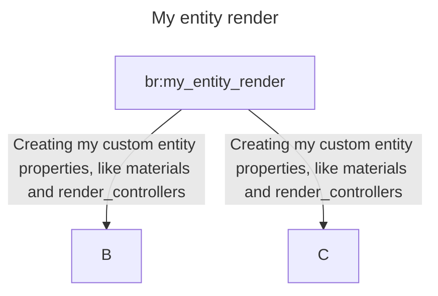

# Bedrock Render

this repository was created for investing about types of entities render in Minecraft bedrock.

when i refer to "types of entities render", i refer to this one:


```json
{
	"format_version": "1.10.0",
	"minecraft:client_entity": {
		"description": {
			"identifier": "br:my_entity_render",
			"materials": {
				"default": "entity_alphatest"
			},
// ...
		}
	}
}
```

> [!NOTE]
> Comming soon add further information.
