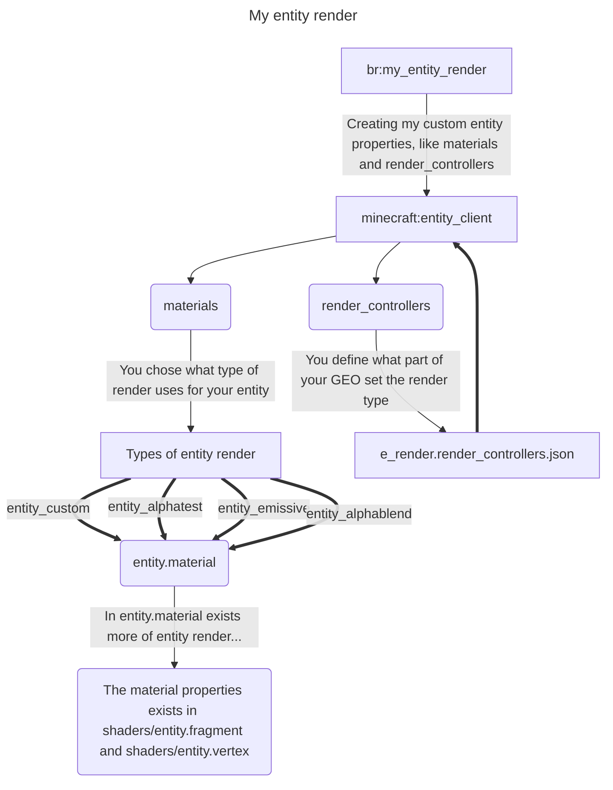

# Bedrock Render
<details>
<summary>Table of contents (Click to show)</summary>

+ [Bedrock Render](#bedrock-render)
+ [Entity render Diagram](#entity-render-diagram)
+ [1. Entity Client Components](#1-entity-client-components)
  + [1.1 Entity Material](#11-entity-material)
</details>
this repository was created for investing about types of entities render in Minecraft bedrock.

when i refer to "types of entities render", i refer to this one:

> [!warning]
> Diagram only show on GitHub web :(
## Entity render Diagram


an example about the diagram:

## 1. Entity Client Components
```json
{
	"format_version": "1.10.0",
	"minecraft:client_entity": {
		"description": {
			"identifier": "br:my_entity_render",
			"materials": {
				"default": "entity_alphatest"
			},
// ...
			"render_controllers": [ "controller.render.my_entity_render" ],
		}
	}
}
```
in this JSON file define the entity client components like texturing, geometry, etc, but the important now is `materials` and `render_controllers`.

### 1.1. Entity Material
The entity material is how the entity rendering in-game, like emitter parts or all of her texture, else that the entity texture have opacity (transparent) and many types of renders defined in [entity.material.json | README.md](./materials/readme.md)

examples of renders:
- Emissive


- alphablend
> [!CAUTION]
> image not found :(

- entity_custom

</br>

> [!NOTE]
> Comming soon add further information.
